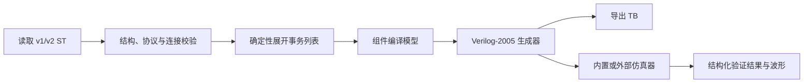

# Simulation Task 组件化设计草案

状态：供评审，尚未实施。对应 `develop_plan.md` 的 1.5.x 第 1 项。本文范围为 Monitor、Driver、Sequencer；1.5.2 只处理已有仿真流程与小项。

## 目标与已有基础

用户在 `.st` 画布放置 DUT、时钟、复位、Driver、Sequencer 和 Monitor，连接协议接口，即可导出可独立运行的 Verilog-2005 testbench，或使用同一生成结果快速仿真。

目前 `packages/hdl-runtime/src/simulationTask/protocolPresets.ts` 已有协议、角色、data/expected/transactions；`protocols.ts` 与 `protocols/` 实现时序，`presets.ts`、`testbench.ts` 负责模块生成。画布在 `taskProjection.ts` 中投影成共享 schematic，协议接口复用 `@veriflow/schematic-core/interfaces`。主要工作是拆分事务来源、协议执行和观察职责，并建立一致的结果通路，无需重新实现所有协议时序。

## 方案比较

| 方案 | 收益 | 代价 |
| --- | --- | --- |
| 直接把现有协议预设改名为 Driver / Monitor | UI 改动少 | 数据仍嵌在预设，无法复用 Sequencer；把主动从机叫 Monitor 会混淆职责 |
| **推荐：保留协议后端，新增三类组件与编译展开层** | 可渐进兼容，CLI/导出/快速仿真一致，能复用事务序列 | 需要 schema、编译模型、连线校验及结果结构 |
| 新建动态验证运行时/UVM 风格调度器 | 能支持复杂并发验证 | 超出轻量 testbench 范围，难以维持内置 Verilog-2005 与外部工具一致性 |

## 组件职责与画布交互

**Driver**：消费 Sequencer 事务，按协议驱动 DUT，负责握手、复位和超时。属性选择协议、角色、位宽、时钟/复位接口、事务间隔。主动主机/发送端和需要回应的从机/接收端均属于 Driver 的不同角色。

**Monitor**：只采样，不驱动 DUT 信号。被动记录实际事务，可选择预期 Sequencer 做顺序比较，输出通过/失败、首个不匹配的位置与值。UART 接收可只观察；AXI 从机、带 ready 的 stream 接收端若需要返回握手必须是响应 Driver。UI 可以把两者一起放在“接收与检查”分类，但不能让 Monitor 隐式成为第二个驱动源。

**Sequencer**：生成有限事务列表。首期提供手动表格、递增、固定种子随机三种来源；支持数量、初值、步长、范围、种子。用户添加指编辑事务表与复用序列，不引入任意 JavaScript/HDL 脚本。

画布保留 HDL 连线；新增带独立样式的事务连接 `Sequencer → Driver`、`预期 Sequencer → Monitor`。事务连接是编译期引用，不能冒充 HDL 标量/总线引脚。Monitor 接 DUT 的协议网络，允许只读扇出。首期一个 Driver 只绑定一个 Sequencer；同一 Sequencer 可被多个消费者引用，各自获得独立列表副本，不共享运行中的队列指针。

## 数据模型与兼容

建议写入 `.st` schema v2，保留 v1 读取器；读取 v1 后在内存中展开为新的编译模型，用户实际编辑保存时才写 v2。既有 clock/reset/stimulus 与 HDL/AD 引用不变。

新增 `verification` 数据区，包含 `drivers`、`monitors`、`sequences` 及以稳定 ID 表示的绑定。每个组件 ID 在整个任务内唯一；协议和角色使用现有 catalog 标识，端口仍由共享接口模型推导。事务类型采用按协议区分的联合类型，避免把 UART 字节与 AXI 突发交易当成任意字符串数组。

编译流水线：

新增 `verification/model.ts`、`validation.ts`、`sequences.ts`、`compile.ts` 放在 `hdl-runtime`，让共享 schematic 保持协议引脚与画布布局职责。`testbench.ts` 只组装生成结果。前端新建独立的 `verificationInspector.ts` 与 `sequenceEditor.ts`，避免继续扩大 `schematic-webview/src/index.ts`。

## 生成、时序和结果契约

- 随机数在 TypeScript 展开阶段使用固定算法与显式 32 位种子生成，不能依赖不同仿真器的 `$random`。递增值按声明位宽截断；手工输入越界则报告具体行号，不静默截断。
- 首期序列为有限列表；单序列最多 10,000 条、单任务展开合计最多 100,000 条，先验证再分配。64 位及更宽数据使用 BigInt 解析和运算，不能经过 JavaScript Number 丢精度。限制值为建议默认值，实施前结合基准测量调整。
- 复位期间 Driver 停止发送、Monitor 清空未完成事务；复位释放后从序列起点重启。时钟协议默认在驱动沿更新、采样沿比较；握手成功才推进索引。所有等待都有超时，任务总 duration 是最终截止时间。
- 序列结束进入 idle；Monitor 对缺失、额外、值错误和协议超时给出确定的失败结果。涉及背压/事务排序的精确规则由各协议适配器声明，不用通用循环猜测。
- 生成 TB 通过带固定前缀和版本号的 `$display` 行报告组件 ID、事务序号、状态和诊断码；宿主解析为 `{status, completed, expected, failures}`，保留原始 stdout。纯 Verilog-2005 不依赖 `$fatal`：CLI 和扩展根据结构化结果返回失败，而导出给第三方独立执行时也会打印明确 FAIL 摘要。
- 缺少结束标记、任务 duration 提前结束或日志格式损坏均不能判为通过；用户 `$display` 日志不作为验证事件解析。
- 生成器保证快速仿真与导出 TB 内容一致；UI 仅显示共享结果，不独立推断 pass/fail。源码/语义设置变更使结果过期，布局移动不影响结果有效性。

## 分期实施与验收

| 阶段 | 交付 | 粗估工作量 |
| --- | --- | --- |
| A：数据与兼容 | v2 schema、v1 迁移、事务类型、序列展开、输入限制 | 2–3 人日 |
| B：最小完整链路 | UART 与 ready/valid stream 的 Driver + Monitor + Sequencer、生成与结果解析 | 3–5 人日 |
| C：画布与事务表 | 组件面板、事务连线、属性编辑、复制/删除/撤销、状态定位 | 3–4 人日 |
| D：总线适配 | APB、AXI4-Lite，再评估 AXI4 burst、SPI/I2C、RGB888 | 4–7 人日 |
| E：回归与文档 | 内置/外部一致性、跨平台、示例与性能限制 | 2–3 人日 |

总计约 14–22 人日，是包含协议边界验证的估计，不是发布日期承诺。优先完成 A–C 后发布可用增量；AXI4 多 outstanding、乱序、覆盖率、通用 scoreboard、无限/在线序列和脚本扩展不放入首期。

每阶段先补失败用例再实现。关键验收包括：旧 `.st` 导出行为一致；同一种子跨平台产生同样事务；背压下不丢/重发；复位中途恢复确定；被动 Monitor 不生成驱动赋值；失败向 CLI/扩展传播；编辑组件后旧结果失效；导出 TB 与快速仿真使用同一产物。使用内置 Icarus WASM 全量回归，外部 Icarus 作等价性对照，Windows/Linux 至少各跑一遍。

## 建议评审重点

优先确认三个产品决策：Monitor 是否接受严格被动定义；首期是否以 UART + ready/valid stream 为闭环；用户自定义序列是否先限于表格与有限生成器。其余模块边界、迁移与验证策略可在上述范围确定后细化为实施计划。
