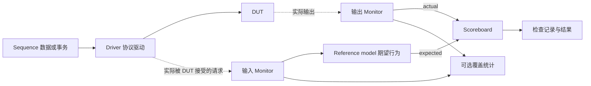
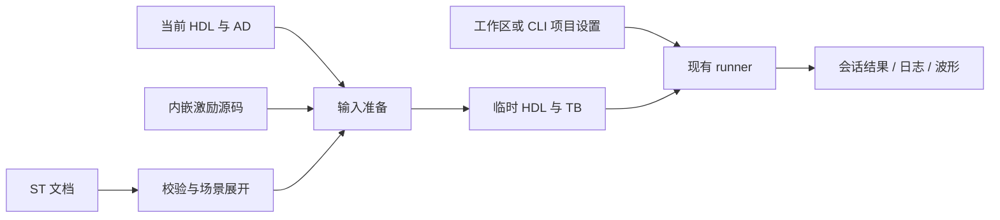

# AD / ST 统一工作台设计

> 历史方案，已由 2026-09-16 的 AD/ST 核心统一方案取代；文中的用例矩阵、验证环境、拖放和独立编辑页面不代表当前功能。当前使用说明见 [Simulation Task](../../simulation-tasks.md)。

日期：2026-09-15
修订：按用户补充加入原生拖放验证与可组合验证环境，取消未发布 ST 的格式迁移。
状态：用户已批准，进入实施。最新约定：菜单为“插入 HDL 模板”，所有局部模板只插入光标处，不识别、校验或调整语法位置。
配套计划：[实施计划](../plans/2026-09-15-ad-st-unified-workbench.md)

## 1. 目标和已确认决策

在现有 AD 图形编辑器和 ST 仿真能力上，统一文件创建、侧边栏与图形交互。AD 负责结构设计，ST 负责仿真环境与执行，两者使用同一套图形编辑器。

- 侧边栏固定为「文件浏览」「架构设计（AD）」「仿真任务（ST）」三个同级视图。
- AD / ST 新建只选择保存位置并命名文件，不再先填写一遍名称。
- 文件浏览负责源码与模块操作，可以把模块快速添加到 AD / ST。
- 模块支持右键添加，并优先提供 VS Code 原生拖放；实际宿主不支持对应拖放路径时仅保留右键添加，不引入绕过宿主的拖放实现。
- AD 提供设计编辑、依赖树、RTL 预览与显式导出；没有全局 Design top 选择。
- ST 默认打开图形环境；使用 AD 的完整画布、连线、属性面板和交互，不继续维护简化 SVG 画布。
- 时钟、复位和激励都是可添加、选择、连接、配置的图形组件。
- 自定义激励：选择模板或定义端口 → 打开原生文本编辑器 → 编写 Verilog → 保存并自动加入 ST。
- **用户已确认：自定义激励默认内嵌 `.st`，支持另存为 `.v/.sv`。**
- 仿真器、波形器只提供 `builtin` / `custom`，在设置里选择和配置；ST 不保存或编辑工具选择和命令。
- 保留当前用例、参数扫描、协议、检查、探针、取消、失败重跑、会话结果和 CLI 能力。
- monitor、scoreboard、driver、参考模型等都是可选的可编辑 HDL 组件；空白 ST 不强制生成完整验证框架。
- ST 尚未发布：直接重构其文件格式与测试夹具，不开发旧 ST 读入、升级、设置迁移或兼容层。
- Simulation Task 栏保留独立的“运行传统 Testbench…”功能：直接运行现有 `.v/.sv` 顶层，不要求创建 `.st`、AD 或图形验证环境。
- 保留传统 Testbench 生成能力，取消独立生成页面；通过 HDL 编辑器内的模板选择器、右键子菜单与 VS Code 命令生成骨架或插入常用代码。

本设计替代旧 ST 设计中「独立表单页面」「任务内配置 backend」「添加 AD 时向工程导出 RTL」的决定；旧设计其余结果语义、协议能力和临时产物约束继续有效。

## 2. 实施前基线与问题依据

下表记录设计启动时的旧实现，用于解释决策，不代表 2026-09-15 实施后的当前状态。

| 位置 | 实施前实现 | 设计影响 |
|---|---|---|
| `veriflow-vscode/src/workflowViews.ts` | Design top、Graphical designs、Design hierarchy、模块库混在 Design 视图 | 文件发现和 AD 设计没有独立边界 |
| `veriflow-vscode/src/extension.ts` | 注册 design、modules、results 三视图，其中 modules 实际承载 ST | 视图名称、标识与内容不一致 |
| `veriflow-vscode/src/archDesign/archDesignCreation.ts` | `requestModule` 后再 `requestTarget` | 同一新建流程问两次名称 |
| `veriflow-vscode/src/simulationTask/taskEditorHtml.ts` | 独立 Environment / Cases / Results 页面、独立样式 | AD 和 ST 缺乏统一视觉和交互 |
| `veriflow-vscode/src/simulationTask/taskCanvasClient.ts` | 另外绘制 SVG，仅复用布局结果 | AD 的交互改进无法自动惠及 ST |
| `veriflow-vscode/src/schematic/protocol.ts` | 可编辑协议直接绑定 ArchDesignEdit / ArchDesignState | 共享完整编辑器需要抽出公共命令与能力，而非伪装 ST 为 AD |
| `veriflow-vscode/package.json` | 全局工具配置已经只有 builtin / custom | 保持这条产品约束，修复 ST 偏离 |
| `taskEditorHtml.ts`、`taskController.ts`、`extension.ts` | ST 提供六种 backend；执行从任务读取 backend/命令 | 不能只删除下拉框，需要统一实际执行配置 |
| `taskController.ts`、`packages/cli/src/runtime/simulationTaskWorkspace.ts` | ST 引用 AD 时先向工程导出文件并重新索引 | 改为运行时临时生成，不污染源码目录 |
| `packages/flow-core/src/simulationTask/compiler.ts` | steps 完成即 `$finish`，duration 当前为超时上限 | 空 steps + 自定义激励可能立即退出，需要新的结束策略 |

工作区已有大量未提交的 AD 修复与 ST 重构。本计划以当前工作区为起点，不覆盖旧文档，不回退现有改动；实施前记录基线和已有失败。

## 3. 路线选择

| 路线 | 好处 | 代价 | 判断 |
|---|---|---|---|
| **抽取 AD 的共享编辑器，分别适配 AD/ST** | 视觉、交互和后续修复共享；保持领域边界 | 需要梳理消息协议和属性面板 | **推荐** |
| 给当前 ST 页面套 AD 样式 | 初期改动较少 | 继续维护两套画布、连线和快捷键 | 不满足长期统一目标 |
| 把 ST 文件直接改成 AD 加仿真字段 | 部分编辑逻辑可直接调用 | 可综合设计和仿真行为耦合，AD 导出受仿真语义影响 | 不采用 |

共用编辑器不等于共用文件格式。`.ad` 是设计文档，`.st` 是仿真任务文档；两者投影到公共图形模型，编辑再分别写回原文档。

## 4. 侧边栏与职责

```text
VERIFLOW
▾ 文件浏览                         [刷新] [筛选]
  ▾ rtl/
    ▾ uart.v
        uart_tx                    → 打开定义 / 添加到 AD / 添加到 ST
        uart_rx
  ▾ tb/
    ▾ stimulus.v
        stimulus
▾ 架构设计（AD）                   [新建] [刷新]
  ▾ soc.ad
    ▾ 依赖树
        u_uart : uart
        u_fifo : fifo
      查看 RTL
▾ 仿真任务（ST）                   [新建] [刷新]
  ▾ uart_loopback.st       ●运行中
      环境
      用例（3）
    ▾ 本次结果
        default       完成，未验证
        parity        通过
        overflow      检查失败
  ▾ 传统 Testbench
      运行现有 Testbench…
    ▾ uart_tb · tb/uart_tb.v        [运行] [打开源码]
        最近结果                   [日志] [波形]
```

### 文件浏览

- 以工作区根目录 / 文件夹 / HDL 文件 / 模块排列；外部库独立子目录，路径和同名模块来源可辨识。
- 范围为 HDL 相关文件（`.v/.sv/.vh/.svh`）与模块，不重复列出 AD / ST 文档；通用工程文件继续使用 VS Code Explorer。
- 点击文件打开文本，点击模块定位声明；支持刷新、搜索/筛选、复制模块例化、查看该模块的只读结构图。
- 文件级新建、重命名、删除、显示于系统文件管理器使用明确文件上下文。模块级操作不把“删除模块”误实现为删除整个文件；符号改名仍走已有语言工具支持范围。
- 不包含全局 top、设计层级、运行状态。只读结构图的根就是用户点击的模块。
- 「添加到 AD / ST」显式携带源码 URI + 模块名，不能只用模块名匹配。目标编辑器必须属于对应类型。
- 有焦点的对应编辑器直接作为目标；没有焦点目标时显示该类型文档选择器，其中有“新建并添加”。不能因历史 activeTask 存在就静默改另一个文件。
- 在目标中创建实例，不复制或移动源码；重复添加同一模块生成独立实例名，如 `u_uart`、`u_uart_2`。默认将未连接端口留空，不自动按名字短接。
- **右键入口始终提供**“添加到 AD…”和“添加到 ST…”，与拖放调用同一个插入服务。
- **原生拖放优先**：模块可拖到 AD/ST 侧栏中的具体文档节点，表示给该文档添加实例；拖到已打开的画布则放到落点附近。只复制引用，不移动源文件。根目录或空白侧栏不是隐式目标。
- VS Code 有正式 `TreeDragAndDropController` API；本仓库安装的类型声明也包含该接口。可直接验证树到树的添加；**API 存在不等于树到 Webview 一定可用**，后者必须实测。Webview 的拖放可能要求按住 Shift，应按宿主原生行为提示，不截获普通拖动来强行添加。
- 自定义 MIME 携带模块 URI+名称的序列化数据；树到 Webview 若拿不到可靠的模块身份，不退化为“只按文件名猜模块”。不依赖 VS Code 私有 tree handle、全局“最后拖动模块”状态或模拟鼠标。
- 拖动多个模块，一次插入、一次撤销；拖文件且含多个模块时让用户选择，不导入未选择模块。放入只读/已关闭目标、取消拖动、索引已失效都不改文件。
- 实施时分别在最低支持版本（当前 manifest 为 VS Code 1.82）和开发使用版本验证树→文档、树→画布/Shift→画布。确认支持的路径启用；宿主不支持的路径仅提供右键，不仅凭 Webview 文档缺少例子就省略验证。

平台依据：[VS Code 拖放 API](https://code.visualstudio.com/api/references/vscode-api#TreeDragAndDropController)、[微软树视图拖放示例](https://github.com/microsoft/vscode-extension-samples/blob/main/tree-view-sample/src/testViewDragAndDrop.ts)、[Webview 拖放与 Shift 行为讨论](https://github.com/microsoft/vscode/issues/182449)。本轮已核查 API 和官方资料，尚未运行本扩展的拖放验证。

### 架构设计（AD）

- 以 `.ad` 为根节点，可同时展开多个文档；不需要先选择“当前设计 top”。
- 展开依赖树按实例显示，重复例化分别存在，递归环标记后停止展开；缺失/歧义定义可定位。
- 依赖来自 `.ad` 当前结构及其引用的 HDL 依赖，不要求先导出 RTL。
- “查看 RTL”为当前设计生成只读预览，不写工程文件；“导出 RTL”仍是明确的 AD 操作。
- 顶层模块由 `.ad` 文档确定；查看 RTL、分析依赖和导出都接收明确 AD URI。
- 可从 AD 文件上下文“添加到 ST”，作为带来源链接的设计实例。

### 仿真任务（ST）

- 图形任务以 `.st` 为根，子节点统一为环境、用例、本次结果；同栏保留“传统 Testbench”分组。会话内更早运行放在对应结果区，不新增第四个顶级 Results 视图。
- 运行/停止/查看结果以任务 URI 为边界。编辑 B 时，A 的运行状态和结果仍属于 A。
- 图形任务和传统 TB 共用一次运行一个目标的调度边界；运行中可以查看、编辑其他任务，不增加跨任务并发功能。
- 手写 TB 首选“运行传统 Testbench…”直接执行；另外保留可选“从现有 Testbench 新建 ST”，保存引用时才创建 `.st`。两者都以明确源码和 HDL 顶层作为入口。
- 新侧栏与新命令不隐式退回全局 top 或旧 workspaceState 仿真流程；不新增历史任务导入/迁移入口。现有手写 HDL TB 仍可作为普通源码创建任务。

### 独立运行传统 Testbench

- Simulation Task 栏的“传统 Testbench”分组提供“运行现有 Testbench…”；选择已索引模块或浏览 `.v/.sv` 文件，确认顶层后直接分析依赖、编译、运行。无 `.st` 文件的纯 HDL 工程也能使用。
- 不以文件名包含 `tb` 或无端口作为硬条件过滤候选；同名顶层必须通过源码 URI + 模块名/定义身份消除歧义，一个文件有多个模块时明确选择。
- 选择入口只属于传统 TB 功能，不恢复文件浏览或 AD 的全局 Design top。点击该功能时，即使存在活动 `.st`，也不会改成运行图形任务。
- 分组显示当前选择的源码和模块，提供运行、停止、打开源码、最近日志和波形；结果绑定该 TB 运行 ID。打开图形 ST 不把传统 TB 结果挂到 ST 下；反之亦然。
- 复用现有 HDL 依赖解析与仿真服务，传递明确顶层；执行前保存该 TB 及实际依赖的未保存编辑，失败则停止。include、宏、运行数据和工作目录语义沿用现有传统执行约定，不自动改写用户文件。
- 时钟、复位、激励、结束及 `$dumpfile/$dumpvars` 等由手写 TB 自己控制；不生成 wrapper TB，不注入 clock、reporter 或 finalize，不要求 `VFST_DONE`。`$finish` 在传统 TB 中是正常结束方式；无波形时仍能查看日志和执行结果。
- 仿真器/波形器仍从有效资源设置读取且只有 builtin/custom；真实时间超时与取消仍受宿主管理，不能因 TB 忘记结束无限占用运行槽。
- 正常退出显示“运行完成（未自动验证）”；编译/执行错误、超时、取消各自显示。普通 `$display("PASS")` 不自动判为检查通过；不强制手写 TB 接入图形组件报告协议。
- 点击波形只打开本次确认产生的文件，不将此前残留波形当作新结果；传统 TB 显式产生的文件遵循现有行为，不因图形 ST 的临时产物规则修改其 HDL。
- 可记住最近选择作为界面状态，但运行结果仍只保留当前会话；不需要新建持久化传统任务格式，也不读取或升级旧 workspaceState 任务。

### 在文本编辑器中生成与补充 Testbench

**推荐：单层 VeriFlow 右键子菜单 + 可搜索模板选择器 + 常用模板直达命令。** 所有入口调用同一套模板服务。保留旧生成器的代码生成能力，移除 `TestbenchPanelProvider` 的 Webview 页面及其独立生命周期。

| 组织方式 | 优点 | 问题 | 选择 |
|---|---|---|---|
| 每个模板直接铺在右键菜单 | 少一次点击 | 模板增长会占满菜单，未来 monitor/scoreboard 更难组织 | 不采用 |
| 按时序/激励/验证再嵌套多级子菜单 | 分类明确 | 深层悬停操作慢，难搜索 | 不采用 |
| **一个 VeriFlow 子菜单，模板在 Quick Pick 搜索** | 主菜单只占一行，模板可扩充，鼠标与键盘入口统一 | 插入模板多一次选择 | **推荐** |

```text
HDL 编辑器右键
└ VeriFlow                         ← 根菜单只占这一项
  ├ 例化模块…                      ← 复用现有命令
  ├ 插入 HDL 模板…           ← 打开可搜索 Quick Pick
  ├ 格式化 HDL                     ← 复用现有命令
  └ 运行当前 Testbench…            ← 复用独立传统 TB 执行

插入 HDL 模板…
  搜索：clock / 时钟 / reset / 波形 …
  常用：时钟、复位、仿真超时、VCD 波形
  结构：完整 TB 骨架、initial 激励块、仿真时间单位
  流程：等待时钟周期、结束仿真
```

- 右键只出现一层 VeriFlow 子菜单，固定不超过五个动作；具体模板数增长不增加右键项，也不再套一层“时序→时钟”。现有例化和格式化 command ID 保留，移入子菜单但不重复放在根菜单。
- “插入 HDL 模板…”在命令面板同样可用；时钟、复位、超时、波形等常用项有独立的 `VeriFlow: HDL ...` 命令，可搜索、绑定个人快捷键；不强占新的默认快捷键。
- Quick Pick 是一个扁平可搜索列表，用分隔标签组织常用/结构/流程；描述显示模板用途、插入范围、默认参数。不要要求先选分类再选模板，也不让参数每改一项重新回到列表。
- 模板插入后使用原生 snippet 的 Tab 占位编辑信号名、周期、复位时长等适合就地修改的字段；需校验时间单位/依赖的复杂选项在插入前收集。模板较复杂时可打开只读文本预览，确认后再插入，仍不创建专用页面。
- 第一版不添加全量补全前缀和灯泡操作，以免与 HDL 补全和语义修复混在一起。后续高频需求再考虑少量 snippets；其内容必须来自同一模板源。

平台能力依据：[VS Code 菜单及子菜单贡献点](https://code.visualstudio.com/api/references/contribution-points#contributes.menus)、[Quick Pick 交互规范](https://code.visualstudio.com/api/ux-guidelines/quick-picks)、[原生 snippet 编辑](https://code.visualstudio.com/docs/editing/userdefinedsnippets)。以上方案可使用稳定扩展 API，不依赖自定义菜单或新 Webview。

#### 模板内容与适用范围

| 模板 | 生成内容 | 必须明确的上下文 |
|---|---|---|
| 完整 TB 骨架 | timescale、module/endmodule，以及可选时钟、复位、超时、波形；可选择一个或多个 DUT | 创建新文本文件或填充空白文档，不覆盖当前非空模块 |
| 时钟 | 新信号声明（可选）、初始化、周期翻转块 | 周期/频率、初值、时间单位；复用已有信号时不重复声明 |
| 复位 | 新信号声明（可选）、有效值与释放流程 | 极性、持续时间或时钟周期；按周期释放时明确参考时钟与边沿 |
| 仿真超时 | 独立 initial 看门狗、超时日志与结束 | 仿真时间上限，不是宿主真实时间 timeout；传统 TB 可以使用 `$finish` |
| VCD 波形 | `$dumpfile` / `$dumpvars` 初始化块 | 文件路径、记录层级与当前模块；不添加仿真器/波形器选项 |
| initial 激励块 | 模块级 initial begin/end | 用户在块内编辑激励，默认不带结束整个仿真的语句 |
| 等待时钟周期 | repeat + 指定边沿等待 | 插在已有 initial/task 等过程块内，不能作为模块级独立语句 |
| 结束仿真 | `$finish` | 过程语句；只用于传统 TB 上下文 |
| 仿真时间单位 | timescale 指令 | 放在目标模块前的合法文件级位置，不悄悄改变其他模块的有效时间单位 |

普通 HDL 文本编辑器中的 signal 名可从选中文本/当前模块声明预填，但只接受可验证的标识符；无明确候选时使用默认值并让用户修改。已有声明的类型、宽度或驱动与模板不相容时必须提示，不重复声明、不新增冲突驱动。多个时钟可以按不同信号名重复添加。

周期默认以周期值配置，频率输入作为可选便利形式；按当前有效 timescale/精度计算，不沿用现有生成器固定按 ns 计算 MHz 的假设。精度不能表示半周期时显示诊断，不默默取整。无法可靠解析宏/include 中的时间单位时询问用户本次单位，不能默认整个工程都是 1ns。

#### 插入与编辑保护

- 在打开的 `.v/.sv` 或已设置 Verilog/SystemVerilog 语言的未保存文本中操作；不要求文件名带 tb。命令捕获发起时的 editor、URI、version 和 selection，弹出选择器后切换文件不能把代码插到别处。
- 所有局部模板直接插入光标处，不识别模块/过程/文件级语法位置、不自动搬移。放错位置由用户撤销处理。
- 选中的信号名用于预填，不默认用整块模板替换选择内容；第一版结构模板限制单光标，避免多个时钟/结束块无意批量插入。多光标给出清晰提示，现有模块例化自己的选择替换行为不受影响。
- 模板整体通过一次 SnippetString 插入光标处，一次撤销；声明及指令均由用户在源码中安排，不作多位置编辑。
- 识别到同一信号已有驱动、同模块已有 dump 块或已知重复超时块时显示定位和取消选项，不自动覆盖/叠加。静态分析无法证明是否重复时明确让用户审查预览，不承诺发现所有宏展开行为。
- 插入只修改编辑器缓冲区，保留用户 Ctrl+S、Undo/Redo 和格式习惯；不自动保存、不运行、不创建 `.st`。需要运行时用同一子菜单的“运行当前 Testbench…”。
- ST 内嵌 HDL 编辑器可复用适用的普通代码模板，但过滤 `$finish`、全 TB 骨架、全局 dump/timescale 等由 ST runner 管理的操作；“运行当前传统 Testbench”在该上下文隐藏，执行仍从所属 ST 发起。命令处理器也检查上下文，不能通过直达命令绕过。传统 TB 文件不受这条 ST 专用限制。

#### 保留完整生成能力

- 原有 `veriflow.generateTestbench` 命令保留为“新建传统 Testbench…”，打开原生编辑器；Simulation Task 栏的“传统 Testbench”分组可提供同一个新建入口。
- 从已打开非空文件调用完整骨架时，创建新的未保存 HDL 文档，不替换现有内容；从空白 HDL 文档调用可以填入当前文档。默认建议 tb_top.v 或所选 DUT 对应文件名，最终由原生另存为命名。
- 可在 Quick Pick 中选择一个或多个 DUT 和要加入的基础模板；已选择 DUT 的端口/参数声明和实例文本复用现有 formatter/模块索引，生成后直接在源码修改映射和参数，不另做一套例化编辑页面。
- 手工追加 DUT 继续使用现有 `veriflow.instantiateModule`。同名模块按来源区分，多个 DUT 不自动把所有同名信号短接，参数化位宽保持正确表达式，无法解析时不默默降为 1 位。
- 用户的已有 TB、生成代码及后续修改保持普通 HDL；完整骨架和局部模板共用基础生成函数。传统超时结束块与 ST 模块模板分别使用各自结束策略，不能直接复用含 `$finish` 的完整 TB 片段到 ST 组件。

## 5. 统一新建与命名

**AD / ST：点击新建 → 保存对话框输入文件名 → 创建并打开图形编辑器。**

- 默认目录：命令携带的文件夹，其次当前对应文件所在目录，最后工作区根；多根工作区缺少上下文时才选择根目录。
- AD 默认 `design.ad`，ST 默认 `simulation.st`；文件名冲突给出下一个可用建议，不覆盖现有文件。
- ST 显示名随文件名，移除独立 Name 编辑框。AD 标签也显示文件名。
- AD 内部 Verilog 模块名仍必须存在：新建时由文件主名派生，之后作为 AD 文档语义保存。文件改名不偷偷改 HDL 接口名。
- 派生规则：合法 ASCII Verilog 普通标识符直接使用；其他字符替换为 `_`，连续 `_` 合并；空值或全 `_` 回退 `design`；数字开头加 `design_`；关键字加 `_design`。例：`soc-top.ad → soc_top`，`123.ad → design_123`。
- 新建后的属性面板显示派生模块名，允许高级修改；不用再弹一个必填名称框。同名 HDL 定义冲突给出来源诊断，由用户改模块名或选择明确引用。
- 原有 `.ad` 的 `module` 保留；ST 直接以文件名显示，不新增独立可编辑任务名称字段。
- 新建为空画布：AD 提示添加模块/端口，ST 提示添加模块/仿真组件；均不强迫选择 top 或模板。

## 6. 同一图形编辑器，不同能力

```text
┌ 工具栏：添加模块  添加组件  连线  删除 | 布局/缩放/搜索 | [主操作] ┐
│ ST 专属：用例 default ▾   运行当前 ▾   停止   结果                 │
├────────────────────────────────────┬────────────────────────────┤
│                                    │ 属性                       │
│  时钟 ─┐                           │ 选中实例：u_uart           │
│  复位 ─┼── DUT ── 检查/探针        │ 参数、端口、来源           │
│  激励 ─┘                           │ 或时钟/复位/激励参数       │
│                                    │                            │
├────────────────────────────────────┴────────────────────────────┤
│ ST 抽屉（可收起）：用例与检查 | 运行结果 | 日志                    │
└ 状态栏：选择、连接状态、诊断、运行摘要 ────────────────────────────┘
```

| 能力 | AD | ST |
|---|---|---|
| 节点外观、端口形状、连线、选择、布局、缩放、搜索、小地图 | 同一实现 | 同一实现 |
| 参数属性、定义跳转、诊断、撤销/重做、快捷键 | 同一交互规范 | 同一交互规范 |
| 添加设计顶层端口 | 是 | 否；探针和激励端口承担仿真边界 |
| AD 逻辑工具 | 原有逻辑工具 | 复用合适的逻辑组件及其属性交互 |
| 时钟、复位、自定义激励 | 不引入不可综合逻辑 | 是 |
| 主操作 | 查看 / 导出 RTL | 运行当前 / 全部用例 |
| RTL 导出按钮与快捷键 | 是 | 不注册、不显示 |
| 查看执行生成 TB | 无 | 仅结果/诊断内的只读调试入口 |

- 共用 `packages/schematic-webview` 入口、主题变量、图标、间距、弹窗和工具栏；不为 ST 新设一套视觉规范。
- ST 环境画布始终是主体，不保留大标题 + 长表单的独立主页面。
- 未选中对象时，右侧显示任务的时间单位、精度、结束方式等；选中对象则显示该对象属性。
- 用例、检查和结果在可收起底部抽屉中管理，切换用例不重置画布视角和位置。
- 运行按钮默认运行当前用例，下拉运行全部；侧栏任务行的运行默认全部。按钮文案明确显示范围。
- 运行自动展开结果抽屉，保留画布上下文；没有自动检查的结果明确显示“完成，未验证”。
- 选中用例决定画布的参数覆盖和激励标记；修复现有“协议标记总取第一个用例”的行为。
- `.st` 损坏时显示解析诊断和“打开 JSON”，不自动替换为空任务。未来版本以只读打开。

## 7. 组件与自定义激励

### 组件入口

ST 的“添加组件”使用 AD 逻辑工具相同的选择、预览、参数表单和确认布局，分类为：

1. 时钟 / 复位：周期、初值、复位极性、释放时刻；默认沿用现有语义。
2. 逻辑工具：常量、组合逻辑、拼接、切片等，复用现有 AD 对应定义，不引入第二套端口命名。
3. 激励与驱动：脉冲、数据序列、sequence、driver，以及现有协议模板支持的角色。
4. 观测与验证：monitor、参考模型、scoreboard、checker、轻量覆盖统计；分别生成可编辑 HDL。
5. 自定义 HDL：自定义端口、空模块或从 HDL 文件添加，支持激励和其他验证角色。
6. 探针：波形记录；现有用例检查编辑器仍可独立使用，不强制转换为图形组件。

时钟/复位是具有稳定实例 ID 的图形组件，能移动、复制、删除、连线、查看属性，不是只读 marker。编译时允许复用原有 clock/reset 发射逻辑，不要求为了视觉组件强行改变成熟调度实现。

现有 case steps 与协议事务继续支持。图形组件的输出与步骤驱动使用同一驱动检查，禁止对同一网络重复激励。协议开漏网络保留既有显式解析规则，不能对所有 inout 一概放开多驱动。

### 自定义 HDL 组件创建（激励与验证共用）


- 自定义端口表包含名称、input/output/inout、位宽；方向始终从激励模块自身看。驱动 DUT 的端口通常为 output，读取 DUT 响应的端口通常为 input。
- 添加时可选择“激励 / driver / monitor / 参考模型 / scoreboard / checker / 通用模块”角色。角色决定模板、图标和能力检查，不改变 HDL 端口真实方向，不要求外部模块继承框架基类。
- 激励默认名称自动建议 `stimulus_1` 等；允许在创建表单修改模块标识符，但不额外弹必填命名步骤。
- 模板输出可直接编辑的完整 HDL 模块，不是 JSON 步骤，不是嵌在 TB 内的 task 片段。
- 内部默认生成 Verilog-2005 模板；`.sv` 只代表语言/扩展名，不承诺内部仿真器支持所有 SystemVerilog 特性。
- 代码使用 VS Code 原生文本编辑器，支持高亮、编辑、保存、可用的格式化及诊断。第一版不承诺所有第三方语言服务器支持自定义 URI。
- **源码是端口定义的最终依据**。创建向导只生成一次初始代码，后续保存不得拿模板覆盖用户写的代码。
- 内嵌存储为 `.st` 中的源码字符串及稳定 asset ID，编辑 URI 如 `veriflow-st-source:/<task-id>/<asset-id>/stimulus.v`；运行临时展开为 HDL 文件。
- 每个内嵌源码上限 1 MiB（UTF-8），任务内源码合计 8 MiB；超限可改用外部文件，保存必须明确报告超限，不能截断源码。
- 第一次保存成功时，在一个文档编辑中加入 asset 和实例；取消草稿不留下空实例。语法错误仍允许保存源码，并插入带错误标记的实例，但阻止运行；不伪造已解析端口。
- 再次双击激励实例打开同一源码；保存后更新所有引用该 asset 的实例。
- 删除/改名端口不静默丢线：保留失效连接诊断，用户重连/删除；新增端口保持未连接；位宽改变重新校验所有用例。
- 同一源码可以有多个参数不同的实例。删除实例不删除被复用的源码；清理无引用源码是明确操作。

### 保存、冲突与另存为

- 内嵌编辑器的 Save 先把改动通过 WorkspaceEdit 合入父 `.st`，再保存父文档；父文档写入失败时保留未保存状态，不能报告成功。
- 与 `.st` JSON 同时编辑时，以 asset 内容版本检测冲突。其他不相关字段变化可以合并；同一 asset 已变化则保留草稿，显示“重新加载 / 比较”，不覆盖对方内容。
- 撤销 asset 创建要同步撤销首次实例；已有 asset 源码编辑是独立撤销项。JSON、画布和文本编辑器同步，事件回环要去重。
- “另存为 .v/.sv”默认是导出副本，原任务仍引用内嵌源码；另提供明确的“另存并改用外部文件”，写成功后再原子更新引用。
- 外部文件已有内容时不能静默覆盖；外部引用用相对 `.st` 的路径，允许 `../`。
- `.st` 另存为/移动时，内嵌资产 ID 不变；更新可追踪的外部相对引用。无法跟踪的外部移动报告缺失，不能猜测同名文件。
- 内嵌源码的相对 include/数据路径以 `.st` 所在目录为基准；外部 HDL include 按已有源码目录规则解析。

### 模板、结束与检查

- 修改后的模板是用户源码；记录模板来源只用于说明，不自动升级或再生成。
- 普通自定义模块不强制加入专用控制端口：按指定时长运行即可。
- 有限事务模板可声明完成输出，用户在任务结束策略里选择该输出。模板不直接调用 `$finish`，整个任务由 runner 结束。
- 协议模板来自现有 UART/SPI/APB/AXI-Stream/I2C/AXI4 Full/Lite/RGB888 实现，保持显式角色、时钟、信号映射和超时约束。提供 HDL 模板包装，不另写一套未经验证的协议算法。
- 内置检查模板复用现有结构化检查记录；任意用户 `$display` 和退出码 0 不自动代表检查通过。未经检查的自定义激励完成后仍是 `completed-unverified`。

### 按需搭建验证环境

提供三种使用程度，但不做三种互不兼容的任务类型；始终是同一个 ST 文档，随时增删组件。

| 使用程度 | 图形构成 | 创建体验 |
|---|---|---|
| 简单仿真 | DUT + 时钟/复位 + 一个激励 + 波形探针 | 新建仍为空白，一次加需要的组件即可；不要求 monitor/scoreboard |
| 自动检查 | 在简单仿真上添加 checker，或 monitor + scoreboard + 期望数据 | 每个组件独立添加，可直接对比固定期望序列，不强制参考模型 |
| 完整验证环境 | sequence → driver → DUT，输入/输出 monitor，参考模型，scoreboard，可选覆盖统计 | “添加验证环境模板…”批量生成并连接，可逐个编辑、替换、删除 |



图中 monitor 观察 DUT 接口，图上的分支是端口采样连接；不会截断 driver→DUT 或 DUT→接收端的功能连接。图示只展示单时钟域验证链，跨时钟域必须用独立 monitor 和显式桥接，不能把两个时钟的 valid 脉冲直接拼接。

| 组件 | 责任和默认模板 | 不应混入的责任 |
|---|---|---|
| Sequence / 数据源 | 生成事务内容；有限序列、数据文件、可编辑随机逻辑；可与 driver 合成简单激励 | 不替用户推断 DUT 正确行为 |
| Driver | 将事务变成引脚时序；握手/响应、超时、可选反压策略 | 不当作纯观测 monitor |
| Monitor | 按明确采样事件解码实际引脚活动，输出观测事务与数量 | 不驱动 DUT 的 ready/ack，不自动把每次采样算作一次通过 |
| Reference model | 从输入 monitor 捕获的**已接受请求**计算期望响应；支持用户状态模型 | 不复制 DUT 输出作为期望；不从模块端口名推断算法 |
| Scoreboard | 对比 expected/actual，输出匹配、失配、缺失、多余记录 | 不产生 DUT 激励；不因队列暂时为空就宣告完成 |
| Checker | 单个规则，如值相等、握手时保持稳定、响应期限 | 不要求为简单规则创建完整 scoreboard 链 |
| Coverage（轻量） | 计数、值域 bins、已观察事务数，可选目标 | 不冒充 SV covergroup 或代码覆盖率，默认不参与通过判定 |

monitor 和 checker 使用模板同样可以编辑 HDL；普通 monitor 不添加任何 DUT 输出驱动。若协议需要被动一端产生 ready/ack，那是 responder/driver 的职责，必须作为明确组件存在。端口协议角色在向导中确认，不能仅根据 clk/data 等名字自动判定。

### “添加验证环境模板”的具体流程

1. 在现有 ST 中点击“添加 → 验证环境模板”，选择待测实例；也可从文件模块右键“新建 ST 并添加”后继续。
2. 选择结构：直接激励、流式顺序验证、请求/响应验证。后两者显示 sequence/driver/monitor/参考模型/scoreboard 勾选清单；覆盖统计默认不勾选。去掉参考模型后可选“期望数据序列”；无期望来源则 scoreboard 显示待配置，不产生假期望值。
3. 确认时钟/复位域、协议采样/握手条件、事务字段、期望来源、停止条件。按明确已知接口预填可修改的映射；未映射必需端口显示阻塞项。
4. 预览将新增的组件、内部连接、DUT 接口连接与需用户编写的模块。不存在通用正确参考模型：默认给出可编译的骨架，并在任务中标成“需要实现”；不会自动 pass-through。用户编写模型后显式标记就绪，UI 不声称自动验证了算法正确性。
5. 确认后用一条 WorkspaceEdit 加入所有源码资产、实例和连接；取消不改文档，撤销可整组撤回。不存在新命名对话框，各实例自动取唯一名字。
6. 展开到普通图形组件，可双击任一模块编辑 HDL。新生成且需要实现的参考模型优先打开编辑器；无需轮流打开所有生成文件。模板的视觉分组只影响布局，不锁定成员和文件归属。

已加入的 driver/clock 被复用前必须确认端口兼容及驱动关系，不能批量模板再次驱动已有网络。重复插入模板默认创建独立实例与独立可编辑资产；用户主动选择共享资产时才共享源码。

### 事务连线与调度约定

- 模板首先面向 Verilog-2005：使用 module、普通端口、参数、固定容量数组和 task/function；不依赖 UVM、class、mailbox、SV interface 或动态队列。采用这些验证角色名称不等于引入 UVM。
- 组件互连落为普通 HDL 网络。向导定义事务字段名称、位宽、顺序，生成打包/解包代码；AD 已有分组端口样式可以折叠展示。元数据与真实端口不符时要求修复绑定，不自动改写源码。
- **主动事务通道**（sequence→driver）使用 valid/ready/data，允许反压；**观测通道**（monitor→model/scoreboard）使用 valid/data 事件，不反压 DUT。观察端不够快时固定容量队列溢出必须报告 error，不能丢交易后继续通过。
- 第一版通用链单时钟域，每个观测通道每个采样周期最多一条事务；多通道/多事件必须独立输出或排队，不能用同一周期重复脉冲隐式传两条记录。
- 同步协议 monitor 在协议约定边沿读取**采样前稳定值**，以真实握手为接受事件；例如不能等 DUT 在边沿之后修改 valid/data 再判断该次握手。非握手的组合值 checker 可选边沿后一精度 tick 采样。模板明确采样策略，不统一施加一种延时。
- monitor 锁存结果后稳定输出给下游；下游在下一约定阶段消费，避免同一 active region 的 HDL 竞争。若未增加真实 CDC 模板，同一观测链时钟域不匹配应阻止连接。
- 共享 reset 时对参考模型状态、monitor 状态和 scoreboard 队列采用同一轮次：默认丢弃复位前未完成事务并记录 aborted 数量，比较总计不清零。复位前发生的失败保持失败；复位不伪造 EOF。高级“复位中断视为失败”可在组件参数中选择。

### Scoreboard 第一版行为

- 提供**顺序事务比较**的完整可执行模板：expected 与 actual 两路各自排队，按到达顺序配对。两路允许不同延迟、actual 先到或同周期到达，不做同周期硬比较。
- 比较支持四态严格比较，字段 mask 显式指定需要比较的位；被 mask 排除的位不计失配，未排除的 x/z 保持四态语义。期望和实际位宽不一致不能静默截断。
- 两路默认队列深度各 256，可配置；溢出为验证环境 error。每次比较记录组件 ID、事务序号、仿真时间、期望与实际数据、字段失配信息。
- 流关闭并结算后：expected 剩余表示缺少实际输出，actual 剩余表示多余输出，均为检查 failed；尚未截止时不能仅凭一侧暂空判断缺失。
- 模板默认至少一次有效比较才视为已验证；零比较显示“完成，未验证”，不会绿色通过。用户可以为测试设置最小/准确交易数，未达到显式要求则 failed。
- 第一版不把通用 scoreboard 宣称为支持乱序匹配。需要 ID 匹配/多 outstanding 时，使用自定义 scoreboard 模块骨架自行实现；该骨架标记需要实现。现有 AXI 模板已支持的范围不因该通用 scoreboard 而扩张。
- 数据文件既能作为 stimulus，也能作为独立 expected 来源；随机源从任务 seed 派生稳定的实例 seed，同一 seed/参数可复现，多实例不共享一个可变随机状态。

### 仿真结束、结算与结果接入

“停止产生激励”与“验证结束”分开。完整模板生成一个 drain/结算控制组件（在“验证控制”折叠组中显示，源码可编辑），而不是在 driver 的 done 上立即结束任务：

1. sequence/driver 的 done 表示不再产生新事务。
2. 时钟、DUT、monitor 继续运行；控制组件按配置等待 DUT drain 条件，并在有界 drain 周期内收集尾部响应。空队列本身不能证明不会再来数据。
3. 明确截止后关闭两路观察流，通知 model/scoreboard finalize；scoreboard 排空已接收事务，检查缺失/多余，输出 summary 和 finalized。单域模板默认留一周期传播锁存的最后事件，再开始结算。
4. 由 runner 收集全部预期 reporter 的最终摘要后结束。缺 reporter 摘要/损坏记录为 error；等不到完成条件超出限时为 timeout；已观察的检查失败保存在详情中，不能被后续复位或超时抹去。

模板向导要求选择 drain 结束依据（明确 idle/done 信号，或用户给定尾部观察周期），不靠猜测 DUT 延迟。duration 到达时也要 finalize，不能直接 `$finish` 丢掉队列；结算允许的额外周期和真实时间上限有界，并记录在任务结果里。没有验证组件的简单仿真不显示 drain/finalize 控件，沿用轻量结束方式。

自动生成的验证控制端口默认折叠，能在“验证控制连接”中查看；编译器以明确端口绑定接入，绝不偷偷强制普通模块加入控制端口。完成模板使用 `finalized` 作为最终完成信号，不能选 driver done 跳过结算。

每个控制组件都有明确 reporter 列表、计量时钟和有界结算周期（默认 8，可设 1–1024，按验证链深度校验）。同一 ST 添加多组环境时追加控制组，任务等待所有组，不覆盖已有报告绑定；第一版不在独立组之间隐式跨时钟传事务。

当前 runner 用固定 `expectedChecks` 校验日志条数，不适合运行时才知道比较数量的 scoreboard。计划增加版本化组件报告协议，按实例 ID+本地序号记录 check/summary，与既有固定 steps 检查分别核对；不得直接放开日志条数校验。每个注册 reporter 必须有唯一终态摘要，摘要数量与实际收到的记录一致。helper task 随生成模块内嵌，外存模块可独立编译；保留这些 helper 即可与 ST 结果面板整合。

结果按组件展示：monitor 观察数、scoreboard 比较/失败/缺失/多余/复位中断数、checker 规则结果、coverage bins。失败可定位画布组件及 HDL 源码；有对应信号和时间时跳到波形。普通 monitor/coverage 计数不算检查通过，custom HDL 未接报告协议仍可运行和看波形，但只能作为未验证执行。

## 8. 运行与配置

### 结束策略

新任务默认“运行指定时长”，避免空步骤立即完成。三个明确策略：

| 策略 | 正常结束 | 上限行为 |
|---|---|---|
| `duration` | 到指定仿真时间，全部预定步骤也已完成 | 到时仍有未完成的预定检查/步骤，判 timeout，不判成功 |
| `steps` | 当前用例步骤完成 | duration 为仿真上限 |
| `signals` | 所有选定完成信号严格为 1，且用例步骤完成 | duration 为仿真上限，等待超时判 timeout |

时钟这类常驻组件不参与“全部完成”的隐式判断。signals 模式只等待明确选中的完成输出；无完成信号的自定义模块使用 duration 模式。边界时刻先完成对应精度 tick 的更新与检查，再作结果归类，避免与超时竞争。

以上是没有 reporter 的基础策略；带验证组件时，达到停止条件后统一经过上一节的 drain/finalize，全部结算成功才产生任务完成标记。

独立 `timeoutMs` 是编译与执行的真实时间限制。生成环境中的自定义 HDL 提前 `$finish`、缺失运行完成标记、未知完成信号、编译错误都有明确错误结果。独立传统 TB 和 `mode=hdl` 由用户 TB 控制结束，不适用生成环境的完成标记和 finalize 要求。

### 工具设置

- 继续使用 `veriflow.simulator`、`veriflow.simulatorCompileCmd`、`veriflow.simulatorRunCmd`、`veriflow.waveViewer`、`veriflow.waveViewerCmd`。
- VS Code 按任务 URI 读取有效设置，遵循资源/工作区/用户作用域；修改设置只影响后续运行。
- ST 属性保留时间单位/精度、时长、超时、种子、include/define、数据文件、场景配置；不包含 backend、工具命令和波形器。
- 并行度、缓存作为执行设置：建议新增 `veriflow.simulation.parallelism`（1–8，默认 1）、`veriflow.simulation.compileCache`（默认 false）。custom 后端不启用内置编译缓存。
- 运行结果可只读显示实际后端；配置缺失的错误提供“打开设置”操作，不在 ST 内增设配置页。
- CLI 的 task 命令增加 `--project <project.json>`，读取已有 Project/ProjectStore 配置；无显式项目时默认 builtin。保留 `--jobs` / `--cache` 作为本次执行覆盖，不回写 ST。两种产品都不再从 ST 读取工具命令。

### 数据流



- AD 输入在临时目录生成 RTL，引用依赖闭包与当前文档内容；不调用向工程发布文件的 `exportArchDesignToFile`。
- 点击运行时保存本任务与实际依赖的未保存编辑，包括内嵌草稿；失败则停止，不运行旧磁盘版本。运行接受后使用该次准备好的输入，期间编辑只影响下次运行。
- 当前运行可以标记“输入已变化”，但不自动重启。结果关联 task URI/run ID，不能被另一个打开的 ST 接收。
- 图形 ST 不增加工程内运行归档、输入快照或长期结果历史；必要展开文件、TB、日志、波形仍放临时目录。传统 TB 保留已有显式文件 I/O 行为，宿主不额外建立归档。
- cache key 必须覆盖内嵌源码、AD 结构及依赖、include、宏、参数、模板版本和工具版本；仅缓存编译产物，不缓存结果。

## 9. 模型与适配边界

### 文件格式

ST 尚未发布，直接修订首版 `schemaVersion: 1`，不建立 v1/v2 双模型。删除本轮开发草稿的废弃字段解析和迁移入口，仓库示例/测试直接更新到目标格式。

- `environment.instances` 统一保存图形实例，引用区分 HDL / AD / embedded / builtin。
- `environment.nets` 仍保存显式网络和位宽；参数化端口宽度未知时保持未知并诊断，禁止画布默认当作 1 位。
- 时钟、复位直接保存为 builtin 实例；通过实例连接映射生成运行时 clock/reset 数据。
- `assets` 保存内嵌 HDL 源码，实例通过稳定 ID 引用；多个实例共享同一 asset。
- `cases` 保留步骤、参数覆盖、扫描轴；`completion` 保存结束策略；`verification` 保存 reporter/结算绑定及目标；`presentation` 只保存布局，不作为连线真相。
- `mode` 保留 generated/hybrid/hdl，普通界面不要求理解这些底层名称；extensions 和 HDL top 用于已有手写 HDL 功能。
- `name` 不再作为文档必填项；UI 和 CLI 的显示名从传入 task URI/path 派生。内部编译模型可有显示名，但不回写文档。
- 组件的角色、模板来源、待实现状态与控制端口绑定属于可验证元数据；它们不取代真实 HDL 源码。普通模块无 reporter 元数据也能加入任务。
- 序列化只输出目标 schema 的字段；废弃 backend/commands 等字段报明确格式诊断，不偷偷解释、迁移或执行。

### 工程边界

1. **共享图形编辑器**：画布渲染、交互、属性控件、工具栏与动作注册；通过 `documentKind` 和能力集合驱动，不读取 `.st` JSON。
2. **AD 适配器**：复用现有 ArchDesignEdit、validation、RTL；负责 AD 文档编辑。
3. **ST 适配器**：组件/网络/用例投影、ST 编辑与校验；不把 ST 强制序列化成 AD。
4. **内嵌源码服务**：可写虚拟文档、保存事务、草稿和诊断映射；不承担仿真调度。
5. **共享输入准备**：在 hdl-runtime 复用解析、AD 生成与依赖解析；供 VS Code 和 CLI 使用，返回临时输入与来源映射。
6. **flow-core**：ST schema、组件降低为编译模型、结束策略、编译和已有 runner；不依赖 VS Code 或 UI 包。
7. **验证模板与报告适配**：生成可编辑 HDL 模块、事务接口描述和组合模板；管理 reporter 摘要/结果映射，不把参考模型算法写进 UI。

公共协议区分语义编辑和布局编辑；每个编辑携带文档 revision，宿主校验能力和版本，拒绝过期写入。隐藏 ST 的导出按钮之外，宿主也必须拒绝 ST 发出的 AD 导出命令。

## 10. 开发期格式整理与保留边界

- 不实现旧 ST 文件读取、升级提示、设置搬迁、版本转换、旧 workspaceState 任务导入或迁移测试。
- 仓库自带的 joint/hybrid/manual 与协议示例在实现期间直接改为目标格式，保留它们验证的功能场景；用户工作目录中的试验文件不自动改写。
- 遇到不符合目标格式的试验 `.st`，显示诊断并允许打开 JSON；不自动清空或重新创建文件。与支持用户手写 TB 是两回事。
- 可重用的 compiler/runner 能力保留，文档模型和运行模型明确分离，不把该接缝设计为对旧 ST 的兼容器。
- 删除仅为未发布 ST 创建的废弃命令和配置；已发布功能的有效入口继续正常工作，清理失效视图菜单。
- 保留现有 `.ad` 文件格式及用户已完成的 AD 修复；只在共享编辑器接入处做必要调整。

## 11. 验收场景

1. 新建 `soc.ad` / `soc_test.st` 各只命名一次；取消不留文件；现有文件不被覆盖。
2. 不选任何全局 top，从文件浏览把同一 HDL 模块分别添加到 AD/ST；同名模块来自不同目录时引用正确。
3. 打开 AD 与 ST，画布外观、选择、拖动、连线、属性、搜索与快捷键一致；ST 无 RTL 导出入口。
4. ST 添加时钟、复位和两个 DUT，连接后运行；不手写 TB，也不往源码目录导出临时 RTL。
5. 从模板生成内嵌激励，编辑保存后出现实例；关闭并重开 ST 内容仍在；修改端口后失效连线可见。
6. 自定义端口创建空模板，手写输出激励；支持 duration 和 signals 两种完成方式，错误完成条件不会显示通过。
7. 内嵌激励导出副本及切换外部引用均可运行；多实例共享源码不重复编译模块。
8. 在设置切换 builtin/custom，ST 编辑器不显示后端列表或命令；编译与打开波形分别使用实际设置。
9. 更新后的 joint/hybrid/manual 及协议示例运行正常；四态检查、开漏、扫描、取消和失败重跑不退化；不存在旧 ST 迁移入口。
10. 多 ST / 多编辑器同时打开，运行、保存、结果与撤销目标正确；父 ST/源码冲突不会丢编辑。
11. CLI 与 VS Code 对相同 ST 的场景和结果分类一致；CLI 的项目设置覆盖独立于 ST 文件。
12. AD 原有逻辑工具、接口连接、direct inout、RTL 生成与路由回归全部通过。
13. 右键添加始终可用；原生拖到 AD/ST 文档节点及画布分别验证，支持的路径启用，记录宿主不支持路径的右键降级，不宣称未验证的拖放可用。
14. 空白 ST 没有强制验证框架；可只用激励跑波形，也可后加 monitor/scoreboard，不需要重新建任务。
15. 一键添加完整验证环境，生成可分别编辑的普通组件；缺少 DUT 算法的参考模型明确需要实现，未实现时不允许整套模板报告通过。
16. Scoreboard 验证实际先到、期望先到、不同延迟、同周期输入、x/z、mask、缺失/多余、溢出、复位、零交易；无观测丢失或假通过。
17. driver done 后仍捕获尾部响应，最终结算后才结束；缺摘要/重复报告/损坏数据/超时均有可定位结果；动态检查数量正确。
18. 纯 `.v/.sv` 工程从 Simulation Task 栏直接运行传统 TB，全程不创建 `.st`、wrapper 或图形环境；已有 `$finish`、依赖/include/数据和波形行为正确。
19. 传统 TB 与图形 ST 同时可见时操作目标不串；共享取消/运行互斥，日志和波形分别归属；同名顶层可选准确来源，无波形/残留波形/编译失败/超时均处理正确。
20. 原独立 TB 生成页取消，完整 TB 仍可由原生命令生成；已有 `.v/.sv` 可插入时钟/复位/超时/波形等模板，单次撤销、不自动保存、不覆盖原代码。
21. HDL 右键只增加一个 VeriFlow 根项，其子项数不随模板增长；模板可搜索、常用项有直达命令，非 HDL/只读正确处理，光标位置不作语法判断，模块例化命令仍可使用。
22. 文本模板与 ST 内嵌源码上下文区分正确；时钟周期适配不同 timescale，不重复声明/驱动，完整 TB 多 DUT 生成保留参数和来源，不误接同名信号。

## 12. 范围和实施顺序

按五个可验收阶段推进：

1. 统一创建与侧边栏，清除新流程对全局 top 的依赖。
2. 提取共享图形编辑能力，ST 接入 AD 完整编辑器。
3. 组件化时钟/复位/逻辑工具与结束策略；保留已有用例能力。
4. 内嵌 HDL、自定义模板、可组合验证组件、文本编辑和外部文件转换。
5. 配置与临时执行统一、CLI、开发期格式整理和全链路验证。

底层 schema/协议需要先准备，具体依赖按实施计划执行。阶段 2 是视觉一致性评审点，阶段 4 是自定义激励闭环评审点。

本轮不增加协议种类、不重写仿真器/波形器、不重做 AD 视觉、不做通用文件管理器、不加跨任务并发、不发布版本。模板中复杂协议沿用已有能力范围，不扩展成完整验证 IP。

执行约束：Node.js >=24.14.1；本轮不改版本、不发布、不生成发行包。删除被安全策略阻止时按根 AGENTS.md 移入 `.trash` 并保留相对路径。


## 13. 2026-09-15 实施状态说明

本设计已经用户批准并有代码落盘，不再是待批准草案。实际实现将多个计划文件合并：文档类型仍在 `flow-core/simulationTask/model.ts`；激励、验证角色与协议 module 包装在 `componentTemplates.ts`；动态报告在 `verificationResults.ts`；共享输入准备在 `hdl-runtime/simulationTaskWorkspace.ts`；ST 图形编辑事务集中于 `taskAuthoring.ts`，投影在 `taskProjection.ts`。旧文件名仅是设计期建议，不要求为了对齐计划而复制功能。

已运行的定向证据包括首版全部五个 ST 示例 parse/schema 校验、joint/hybrid 真实仿真、7 个 core verification 测试、7 个真实 Icarus WASM verification 集成测试，以及原生源 provider/projection 的 focused tests。完整环境测试使用独立实现的 +3 DUT 与参考模型，确认 16 笔已接受事务及最终尾部结算；默认新模型仍是 needs-implementation，不自动传递实际值作为期望。

最新用户确认覆盖早期位置规划描述：局部 HDL 模板只在当前光标插入，不识别、校验或自动调整语法位置。ST 不添加旧格式迁移，工具选择仍在宿主 Settings/显式 CLI project。当前没有提交或发布，原有大量未提交修改保持原样。

实施及定向验证已完成：随机/文件 sequence、实例 seed、内嵌源码移动/删除保全和真实 Host 模板/执行验证均已补齐。原生树拖放最低版本手测、任意自定义链深证明及全部协议独立参考执行不包含在通过范围；详见[实施记录](../plans/2026-09-15-ad-st-unified-workbench.md#最终实施记录与验证范围)。
